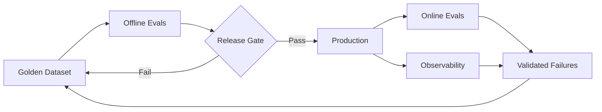

# Production Applied AI

Practical architectures, patterns, and lessons for building reliable enterprise AI agents.

This repository is my technical notebook for moving AI from impressive prototypes to systems enterprises can trust in production.

**Topics:** AI Agents · Evals · MCP & Tool Use · RAG · Voice AI · Observability · Security · Reliability · Production Readiness

## Articles

### [Your AI Agent Passed 99% of Evals. Why Can It Still Fail in Production?](articles/why-99-percent-eval-pass-can-still-fail-in-production.md)

Why a high average score can hide catastrophic failures—and how **golden datasets, offline evals, online evals, release gates, CI/CD, observability and production feedback loops** work together.

### [Responsible AI Is Not a Policy Document: A Production Safety Architecture for AI Agents](articles/responsible-ai-production-safety-architecture.md)

How to translate Responsible AI principles into **runtime controls, bounded autonomy, safety evals, human oversight and operational evidence**.

### [Agentic AI Governance: How Do You Govern a System That Can Take Action?](articles/agentic-ai-governance-action-path.md)

A practical architecture for governing **identity, tools, autonomy, action trajectories, data, change and human approval**—not just the underlying model.

## Applied AI: Production Voice Architectures

Production Voice AI is more than speech quality. This section explores how realtime voice systems combine **audio, reasoning, tools, enterprise integrations, guardrails, evaluation, observability and human handoff** to deliver measurable outcomes.

### [Grok Voice — From Conversation to Business Outcome](articles/solving-real-enterprise-problems-with-grok-voice.md)

A business-problem-first architecture for using **Grok Voice** across telecom support, sales, financial services, field service and multilingual workflows—with tool orchestration, authorization boundaries, evals and measurable outcomes.

### [ElevenLabs — Building Production Voice Agents: The Architecture Beyond a Great Voice](articles/building-production-voice-agents-with-elevenlabs.md)

Using **ElevenAgents** as the reference platform: realtime latency, enterprise tools, guardrails, conversation testing, online evals and human handoff.

### [Cartesia — Building Production Voice AI: Latency Is Only the Beginning](articles/building-production-voice-ai-with-cartesia.md)

Using **Cartesia Sonic, Ink and Line** as the reference stack: end-to-end conversational latency, turn-taking, tool design, bounded actions, evaluation and business outcomes.

### [Deepgram — Building Production Voice Agents: Design the Conversation as a Realtime System](articles/building-production-voice-agents-with-deepgram.md)

Using the **Deepgram Voice Agent API** as the reference: unified vs composable pipelines, turn detection, barge-in, function calling, regional architecture, evals and production feedback.

### [OpenAI Realtime API — Beyond Speech-to-Speech](articles/building-production-voice-agents-openai-realtime-api.md)

Using the **OpenAI Realtime API** as the reference: full-duplex conversation, realtime transports, tool authorization, delegated work, latency budgets, voice-agent evals and graceful degradation.

## Core production-evaluation architecture

> **Observability tells us what happened. Evals tell us whether what happened was acceptable.**

> **The higher the consequence and autonomy, the higher the evidence bar should be.**

More Production Applied AI articles coming soon.
