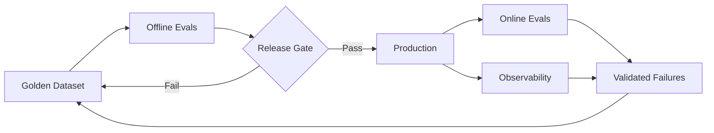

# Production Applied AI

Practical architectures, patterns, and lessons for building reliable enterprise AI agents.

This repository is my technical notebook for moving AI from impressive prototypes to systems enterprises can trust in production.

**Topics:** AI Agents · Evals · MCP & Tool Use · RAG · Voice AI · Observability · Security · Reliability · Production Readiness

## Articles

### [Your AI Agent Passed 99% of Evals. Why Can It Still Fail in Production?](articles/why-99-percent-eval-pass-can-still-fail-in-production.md)

Why a high average score can hide catastrophic failures—and how **golden datasets, offline evals, online evals, release gates, CI/CD, observability and production feedback loops** work together.

### [Responsible AI Is Not a Policy Document: A Production Safety Architecture for AI Agents](articles/responsible-ai-production-safety-architecture.md)

How to translate Responsible AI principles into **runtime controls, bounded autonomy, safety evals, human oversight and operational evidence**.

### [Agentic AI Governance: How Do You Govern a System That Can Take Action?](articles/agentic-ai-governance-action-path.md)

A practical architecture for governing **identity, tools, autonomy, action trajectories, data, change and human approval**—not just the underlying model.

### [Building Production Voice Agents with ElevenLabs: The Architecture Beyond a Great Voice](articles/building-production-voice-agents-with-elevenlabs.md)

A production architecture for **ElevenAgents**, covering real-time latency, enterprise tools, guardrails, conversation testing, online evals, human handoff and business outcomes.

## Core production-evaluation architecture

> **Observability tells us what happened. Evals tell us whether what happened was acceptable.**

> **The higher the consequence and autonomy, the higher the evidence bar should be.**

More Production Applied AI articles coming soon.
