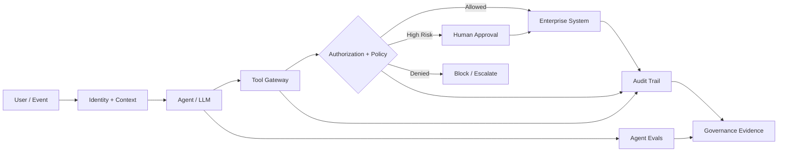

# Agentic AI Governance: How Do You Govern a System That Can Take Action?

Traditional AI governance often focuses on models: which model is approved, what data trained it, and whether its outputs meet quality and risk requirements.

Agentic AI changes the problem.

An agent can **reason, select tools, retrieve data, call APIs, update systems and trigger workflows**. Governance therefore has to cover more than the model.

> **For agentic AI, govern the action path—not just the model.**

## A practical governance architecture



This architecture creates several governance boundaries.

## 1. Govern identity

The agent should not become a super-user.

Actions should execute in the context of an authenticated identity—user, service or delegated role—with least-privilege access.

The question is not only:

**“Can this agent call the CRM?”**

It is:

**“Can this identity perform this specific CRM action on this resource under this policy?”**

## 2. Govern tools

Tools are the agent's hands.

Treat every tool as a governed capability:

- explicit purpose
- narrow schema
- allowed operations
- input validation
- authentication and authorization
- rate/transaction limits
- idempotency where needed
- auditability
- clear owner

Avoid giving the model arbitrary database or infrastructure access when a constrained business API can expose exactly the action required.

## 3. Govern autonomy

Autonomy should be a business-risk decision, not a demo feature.

A useful model is:

```text
OBSERVE   → Agent analyzes but cannot act
RECOMMEND → Agent proposes an action
APPROVE   → Human authorizes execution
EXECUTE   → Agent acts within predefined limits
```

Different actions inside the same agent can sit at different levels.

A service agent might autonomously retrieve an order, recommend a refund, automatically refund up to a small approved threshold, and require human approval above it.

## 4. Govern the trajectory

A final answer can look correct even when the agent took the wrong path.

Governance should therefore evaluate:

- tool selected
- arguments supplied
- sequence of calls
- authorization decisions
- unnecessary actions
- retries
- escalation
- final outcome

> **Correct outcome + unsafe trajectory is still a governance failure.**

## 5. Govern change

Agents change frequently: prompts, models, RAG sources, tool descriptions, policies and orchestration evolve.

Treat these as versioned production dependencies.

```text
Change
  ↓
Golden regression suite
  ↓
Safety + tool + outcome evals
  ↓
Policy gates
  ↓
Canary
  ↓
Production
  ↓
Continuous evaluation
```

High-risk failures should block release regardless of a strong average score.

## 6. Govern data

An agent should retrieve the **minimum context necessary** for the task.

Controls should cover:

- data classification
- permitted sources
- row/document-level access
- PII handling
- retention
- residency requirements
- secrets
- conversation history
- tool outputs

A large context window is not a permission model.

## 7. Govern humans too

Human-in-the-loop only works when responsibility is clear.

Define:

- which actions require approval
- who can approve them
- what evidence the reviewer sees
- timeout/escalation behavior
- whether the action is reversible
- who owns incidents

A vague “human review” box in an architecture diagram is not governance.

## 8. Build an evidence plane

Every consequential action should leave enough evidence to reconstruct what happened.

At minimum:

**Identity → Model/version → Prompt/policy version → Retrieved evidence → Tool call → Arguments → Authorization → Approval → Result → Evaluation**

This evidence supports operations, audit, incident analysis and continuous improvement.

## A governance question I find useful

Instead of asking:

> “Is this model approved?”

ask:

> **“Is this agent authorized to take this specific action, using this data and these tools, at this level of autonomy—and what evidence proves it behaved correctly?”**

That is the shift from **model governance to agentic-system governance**.

---

Part of **Production Applied AI** — practical architectures, patterns and lessons for building enterprise AI systems.
