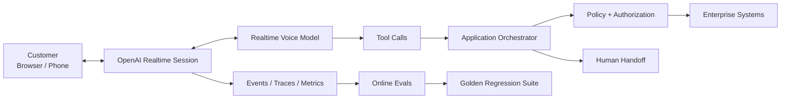

# Building Production Voice Agents with the OpenAI Realtime API: Beyond Speech-to-Speech

Realtime voice changes the architecture of an AI application.

Instead of waiting for speech recognition, generating text, then synthesizing a response as three disconnected stages, realtime models can work directly with live audio and interact continuously with the user.

But production readiness still depends on the system around the model.

Using the **OpenAI Realtime API** as the reference, here is how I think about that architecture.

> **Realtime removes boundaries in the conversation. Production architecture must add the right boundaries back around actions.**

## Reference architecture



OpenAI’s realtime voice stack has evolved quickly. In 2026 OpenAI introduced **GPT-Realtime-2** with stronger reasoning for realtime voice, and more recently **GPT-Live-1**, which brings full-duplex listening and speaking to the API and can delegate deeper reasoning and actions to paired models and tools.

## 1. Full duplex changes conversational design

Traditional systems behave like:

```text
listen → stop → think → speak → stop → listen
```

A full-duplex system can listen and speak at the same time.

That enables more natural interruption and responsiveness, but it also creates new design questions:

- What happens when the user changes intent mid-response?
- Which generated work should be cancelled?
- What happens to an in-flight tool call?
- Which conversation state remains valid?
- When should the agent yield rather than continue?

Realtime interaction needs **state-aware interruption**, not just audio interruption.

## 2. Choose transport based on the channel

For realtime applications, transport is part of architecture.

OpenAI uses **WebRTC** for realtime media experiences, while server-side and telephony patterns may use other supported realtime connection options.

The design should account for:

- browser/mobile media
- server-side control
- telephony
- connection setup
- jitter and packet loss
- authentication
- geographic latency
- reconnect behavior

A great model cannot hide a poor media path.

## 3. Keep business authority outside the model

Suppose a voice agent decides a customer qualifies for a refund.

The model should not become the authorization system.

A safer flow is:

```text
User request
   ↓
Realtime reasoning
   ↓
Tool request
   ↓
Application validation
   ↓
Authorization / policy
   ↓
Enterprise API
   ↓
Tool result
   ↓
Spoken response
```

This gives the realtime model freedom to reason while keeping consequential authority in deterministic enterprise controls.

> **Model proposes. System authorizes.**

## 4. Delegate deeper work without freezing the conversation

Not every task belongs on the immediate voice critical path.

A realtime agent may need to answer quickly while another model, tool or workflow performs deeper work.

Think of two paths:

**Conversation path** — stay responsive, acknowledge, clarify, maintain the interaction.

**Work path** — perform deeper reasoning, retrieval or enterprise actions.

Where the platform and application allow it, separating these concerns can preserve conversational responsiveness without sacrificing task depth.

## 5. Latency is a budget

Measure the entire turn:

```text
Network
+ audio processing
+ turn decision
+ model reasoning
+ tool calls
+ response generation
+ playback
```

OpenAI has described WebRTC engineering around low and stable media round-trip time, connection setup and global routing because realtime conversation exposes network behavior directly to the user.

For enterprise agents, your own APIs often become part of the same latency budget.

## 6. Evals need to include audio behavior and actions

Text-only evaluation misses important failure modes.

A realtime voice evaluation set should test:

- interruption
- overlapping speech
- silence
- noisy input
- ambiguous requests
- tool selection
- tool arguments
- unauthorized actions
- clarification
- multilingual behavior where relevant
- escalation
- end-to-end task completion
- latency

And for agentic workflows, evaluate the **trajectory**.

A correct spoken answer does not erase an unsafe tool attempt.

## 7. Design graceful degradation

Production systems fail.

Plan for:

- lost realtime connection
- tool timeout
- unavailable CRM
- malformed tool response
- repeated misunderstanding
- high latency
- model/service degradation
- handoff failure

The correct response may be retry, fallback, bounded continuation or human transfer depending on the workflow.

Reliability is not pretending failure will never happen. It is deciding what happens when it does.

## 8. Measure outcomes beyond naturalness

A natural conversation is valuable, but enterprise Voice AI eventually needs business evidence.

Track technical signals such as latency, interruption handling and tool success alongside outcomes such as:

- resolution
- containment
- conversion
- appointment completion
- transfer quality
- average handling time
- repeat contacts
- customer satisfaction
- cost per successful outcome

## Production principle

Realtime models can dramatically simplify and improve the human side of voice interaction.

But the enterprise architecture still needs explicit control around identity, tools, policy, state, evaluation, observability and escalation.

> **The goal is not merely realtime speech. It is realtime action with production-grade control.**

## References

- [OpenAI: GPT-Live-1 in the API](https://openai.com/index/introducing-gpt-live-1-in-the-api/)
- [OpenAI: Advancing voice intelligence with realtime models](https://openai.com/index/advancing-voice-intelligence-with-new-models-in-the-api/)
- [OpenAI: How OpenAI delivers low-latency voice AI at scale](https://openai.com/index/delivering-low-latency-voice-ai-at-scale/)
- [OpenAI API documentation](https://platform.openai.com/docs/)

Product capabilities evolve; check the linked documentation for current behavior.

---

Part of **Production Applied AI · Voice AI** — practical architectures, patterns and lessons for production enterprise AI.
