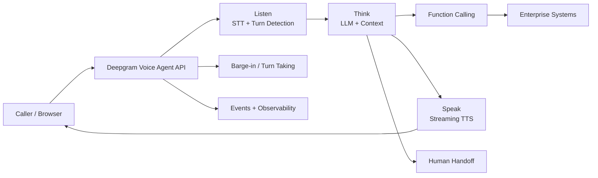

# Building Production Voice Agents with Deepgram: Design the Conversation as a Realtime System

A production voice agent is a realtime distributed system disguised as a conversation.

Every turn combines audio transport, speech understanding, turn detection, reasoning, enterprise tools, speech generation and recovery logic. If any part is slow or unreliable, the customer hears it immediately.

Using **Deepgram** as the reference platform, here is how I think about the production architecture.

> **In Voice AI, latency is experienced as conversation quality.**

## Reference architecture



Deepgram’s Voice Agent API can handle the listening, thinking and speaking loop over a **single WebSocket**, while supporting function calling and configurable models. Deepgram also supports composable architectures where its speech models are combined with external LLM and realtime frameworks.

## 1. Decide managed loop vs composable pipeline

There are two useful architecture patterns.

### Unified agent

```text
Audio ↔ Voice Agent API ↔ Enterprise Tools
```

This reduces integration points and lets one realtime connection coordinate the conversational loop.

### Composable pipeline

```text
Audio → STT → Orchestrator → LLM → TTS → Audio
```

This gives teams more control over model/provider selection and orchestration.

Neither is universally better. Choose based on required control, latency, operational complexity, model flexibility and existing platform architecture.

## 2. Turn detection is a production concern

A voice agent must continuously decide whether to listen, think or speak.

Deepgram’s Flux conversational STT is designed around this problem with model-integrated end-of-turn detection and configurable turn-taking behavior.

This matters because a transcript can be accurate while the conversation still feels bad.

If the agent responds too early, it interrupts the customer.

If it waits too long, the experience feels slow.

Evaluate **turn quality**, not only transcription accuracy.

## 3. Barge-in should cancel work, not just audio

When a caller interrupts, stopping playback is only the visible part.

The architecture may also need to:

1. stop current speech output
2. cancel obsolete generation
3. preserve valid conversation state
4. capture the new utterance
5. decide whether an in-flight tool call remains valid
6. resume from the correct state

Interruption is therefore an orchestration problem as much as an audio problem.

## 4. Function calling connects conversation to business value

A useful enterprise agent might:

- retrieve an account
- check an order
- schedule an appointment
- open a case
- verify eligibility
- transfer a call

Keep tool schemas narrow and validate execution outside the model.

For high-impact actions, separate:

**Reasoning → Authorization → Execution**

The LLM can recommend or request. Deterministic enterprise controls decide whether the action may happen.

## 5. Keep the spoken response designed for speech

Text that looks good on a screen can sound terrible on a phone call.

Voice responses should generally be:

- concise
- conversational
- easy to interrupt
- free of unnecessary formatting
- careful with numbers, IDs and dates
- explicit when confirmation matters

The response is not a document. It is a turn in a live conversation.

## 6. Evaluate the complete call

Offline evaluation should include realistic scenarios such as:

- ambiguous intent
- background noise
- interruptions
- long pauses
- tool timeout
- wrong or missing identifier
- repeated clarification
- policy-sensitive action
- transfer to a human

Measure:

```text
Speech quality
+ Turn quality
+ Task success
+ Tool correctness
+ Safety
+ Escalation
+ Latency
+ Cost
+ Business outcome
```

## 7. Production geography can be architectural

For regulated and latency-sensitive workloads, processing location can matter.

As of September 2026, Deepgram documents a generally available **India regional endpoint** supporting STT, TTS and Voice Agent APIs. That can be relevant when evaluating architectures for Indian enterprise workloads, alongside the customer’s own compliance requirements.

Regional availability alone does not solve compliance—but it becomes one design input.

## 8. Turn failures into regression tests

```text
Real call
 → Online signal
 → Failure analysis
 → Reproducible conversation
 → Golden test
 → Fix
 → Regression suite
 → Controlled rollout
```

This is how a voice agent improves without repeatedly rediscovering the same production failures.

## Production principle

The voice model is only one component.

A production-grade system needs the entire loop—**listen, understand, reason, act, speak, interrupt, recover and escalate**—to work as one realtime experience.

> **The customer does not experience your architecture. They experience the pauses, interruptions, answers and outcomes it creates.**

## References

- [Deepgram Voice Agent API](https://developers.deepgram.com/docs/voice-agent)
- [Build a Voice Agent](https://developers.deepgram.com/docs/build-a-voice-agent)
- [Flux-enabled Voice Agent](https://developers.deepgram.com/docs/flux/agent)
- [Deepgram regional endpoints announcement](https://developers.deepgram.com/changelog/2026/9/15)

Product capabilities evolve; check the linked documentation for current behavior.

---

Part of **Production Applied AI · Voice AI** — practical architectures, patterns and lessons for production enterprise AI.
