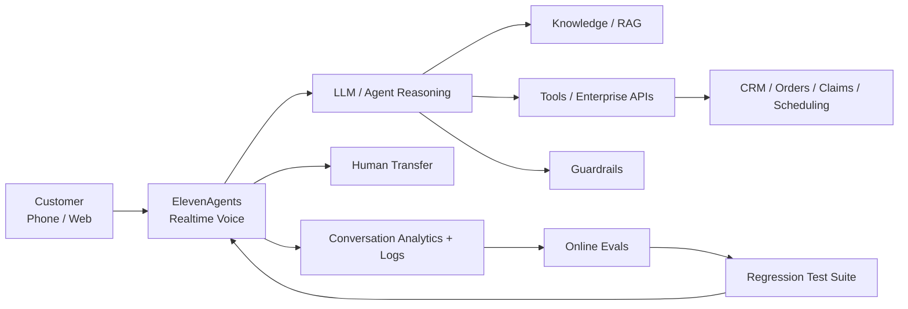
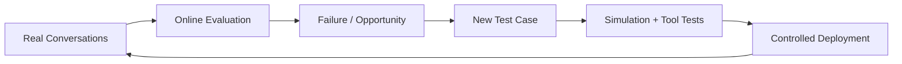

# Building Production Voice Agents with ElevenLabs: The Architecture Beyond a Great Voice

A compelling voice demo can be built quickly.

A production voice agent is a different engineering problem.

Once an AI voice agent starts serving customers, success depends on much more than voice quality. The system must understand users in real time, reason correctly, call the right enterprise tools, remain within policy, handle interruptions, recover from failures, keep latency low and know when to transfer to a human.

Using **ElevenAgents** as the reference platform, here is how I think about that production architecture.

## Reference architecture



The important idea:

> **Voice is the interface. The production system is the agent, tools, policies, evaluations and operational loop behind it.**

## 1. Design for conversation latency

Voice has a different tolerance for latency than chat.

A few seconds of silence feels broken.

Latency is therefore an end-to-end architecture problem:

```text
User speech
  → turn detection / transcription
  → agent reasoning
  → tool calls
  → response generation
  → speech generation
  → audio playback
```

Optimizing only the model misses much of the path.

Useful techniques include parallelizing independent work, preloading predictable context, keeping tool APIs fast, avoiding unnecessary sequential calls, streaming responses and measuring latency at each stage rather than only total call duration.

## 2. Tools turn a voice bot into an agent

A useful enterprise voice agent often needs to do more than answer questions.

It may need to:

- look up a customer
- check an order
- schedule an appointment
- update a case
- validate eligibility
- transfer a call
- trigger a workflow

ElevenAgents supports tools and workflows, but the enterprise APIs behind those tools should remain the authority for authentication, authorization and business rules.

> **The model proposes the action. The enterprise system authorizes it.**

## 3. Safety has a latency trade-off

This is particularly interesting in real-time voice.

ElevenLabs documents layered Guardrails across system-prompt hardening, user-input validation and agent-response validation. Its custom/content guardrails can operate in streaming or blocking modes.

Streaming prioritizes latency, but some audio may begin before a violation is intercepted. Blocking validates before delivery but introduces additional delay; ElevenLabs currently documents roughly **200–500 ms** for blocking validation.

That is not simply a platform setting. It is a **business-risk decision**.

For a low-risk informational assistant, latency may dominate.

For a consequential workflow, stronger pre-delivery validation may be worth the extra delay.

## 4. Test conversations, not just prompts

Voice agents are multi-turn systems.

A prompt test does not tell us whether the agent will:

- maintain context across turns
- clarify ambiguous intent
- select the correct tool
- supply correct parameters
- handle interruption
- recover from a tool failure
- stay within policy
- reach the intended business outcome

ElevenLabs currently exposes three complementary agent-testing patterns: **simulation testing**, **next-reply/scenario testing**, and **tool-call testing**.

That maps well to a production testing strategy:

```text
Scenario tests     → Is the next behavior correct?
Tool tests         → Did it call the right tool correctly?
Simulation tests   → Did the complete conversation reach the goal?
Production evals   → Does it still work with real customers?
```

## 5. Build the offline → online loop

Before release, create regression scenarios from representative and adversarial conversations.

After release, evaluate real conversations for business and agent outcomes.

Production failures should then become new regression cases.



ElevenLabs' production tooling includes conversation analysis, testing, analytics, experiments and conversation history. The platform also recommends staged deployment and feeding issues discovered in production back into the test suite.

## 6. Measure business outcomes

Voice metrics such as latency and call quality matter, but they are not the end goal.

Depending on the workflow, I would also measure:

- containment / successful resolution
- transfer rate
- task completion
- tool success
- policy violations
- user corrections
- repeat calls
- average handling time
- conversion or appointment completion
- cost per successful outcome

A voice agent that sounds human but cannot reliably complete the workflow is still a poor production system.

## 7. Design the human handoff

Human transfer should not be treated as failure.

It is a deliberate safety and customer-experience mechanism.

Define when the agent transfers, what context travels with the call, what happens after repeated tool failures, and which high-risk actions always require human involvement.

The best experience is not “AI at all costs.”

It is **the right automation boundary for the customer journey**.

## Production principle

The question for enterprise Voice AI is no longer:

> “Can the agent have a natural conversation?”

A better question is:

> **“Can it reliably complete the customer's job, within policy, at conversational latency—and recover gracefully when it cannot?”**

That is the difference between a voice demo and a production voice agent.

## References

This article uses current public ElevenLabs documentation as the platform reference:

- [ElevenAgents overview](https://elevenlabs.io/docs/eleven-agents/overview)
- [Agent testing](https://elevenlabs.io/docs/eleven-agents/customization/agent-testing)
- [Guardrails](https://elevenlabs.io/docs/eleven-agents/best-practices/guardrails)
- [Operate: monitoring, testing and optimization](https://elevenlabs.io/docs/eleven-agents/operate/overview)
- [ElevenLabs layered safety framework](https://elevenlabs.io/blog/safety-framework-for-ai-voice-agents)

Product capabilities evolve; check the linked documentation for the latest platform behavior.

---

Part of **Production Applied AI** — practical architectures, patterns and lessons for building enterprise AI systems.
