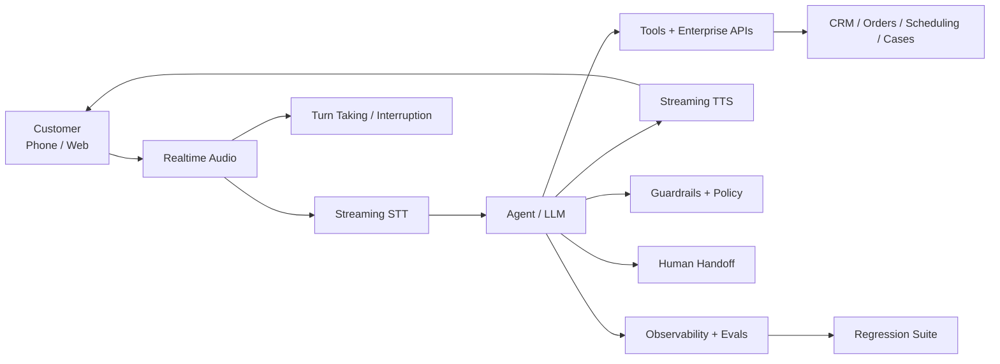
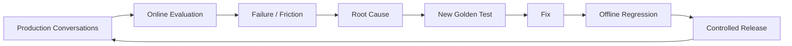

# Building Production Voice AI with Cartesia: Latency Is Only the Beginning

Voice AI becomes difficult the moment a demo meets a real customer.

A production system has to listen through noise, understand turn boundaries, reason over enterprise context, call tools safely, speak naturally, handle interruption, recover from failures, and do all of it fast enough that the conversation still feels human.

Using **Cartesia** as the reference platform, here is how I think about that architecture.

> **Low latency earns the next turn. Reliability earns the customer’s trust.**

## Reference architecture



Cartesia currently offers **Sonic** text-to-speech, **Ink** speech-to-text, and **Line** for voice agents. Its production guidance also covers observability, tool design, guardrails and multi-agent patterns.

## 1. Optimize the whole conversational path

Teams often quote one model-latency number. Customers experience the entire path:

```text
Audio in
 → speech recognition
 → end-of-turn decision
 → reasoning
 → tool/API calls
 → speech generation
 → audio out
```

A fast TTS model cannot compensate for a slow CRM call or unnecessary sequential reasoning.

Measure each stage separately. Then optimize the critical path.

## 2. Treat turn-taking as part of intelligence

Natural conversation is not simply speech-to-text followed by text-to-speech.

The system has to know:

- when the user has finished
- when a pause is only a pause
- when the user interrupts
- when the agent should stop speaking
- when clarification is better than guessing

Poor turn-taking makes even a strong model feel unintelligent.

## 3. Design tools for spoken workflows

Voice agents should not receive broad access to enterprise systems.

Expose narrow business capabilities:

```text
get_order_status(order_id)
check_appointment_availability(location, date)
create_support_case(customer_id, reason)
transfer_to_human(queue, context)
```

Validate arguments outside the model and enforce identity, authorization, business rules and transaction limits in the underlying system.

> **The agent decides what it wants to do. The enterprise system decides what it is allowed to do.**

## 4. Use deterministic actions where determinism wins

Not every step needs agentic reasoning.

If a workflow has an exact rule—identity verification, transaction threshold, mandatory disclosure or eligibility check—keep that logic deterministic.

Use the agent where the path varies: understanding intent, resolving ambiguity, choosing the next appropriate tool and explaining the outcome.

## 5. Make interruption and failure first-class states

Real callers interrupt.

APIs time out.

Audio quality changes.

A production architecture needs explicit behavior for:

- barge-in
- tool timeout
- partial tool success
- repeated misunderstanding
- silence
- dropped connection
- unavailable downstream system
- human escalation

Graceful recovery is part of the user experience.

## 6. Evaluate conversations, not just voices

Natural speech quality matters, but it does not prove the agent completed the customer’s job.

Evaluate:

- task completion
- intent understanding
- tool selection
- tool arguments
- policy compliance
- groundedness
- interruption handling
- escalation correctness
- latency
- cost
- business outcome

For consequential actions, evaluate the trajectory as well as the final spoken answer.

## 7. Close the production feedback loop



The best evaluation dataset is never finished. Production keeps discovering cases the original design did not anticipate.

## 8. Measure the business, not only the audio

Useful operational metrics include latency, interruptions, tool failures and transfer rate.

But the executive conversation should eventually reach:

- successful resolution
- containment
- appointment completion
- conversion
- repeat-call reduction
- average handling time
- customer satisfaction
- cost per successful outcome

A beautiful voice that does not complete the workflow is still a poor enterprise system.

## Production principle

Cartesia’s low-latency speech stack can be an important part of the architecture. But production Voice AI is a **system problem**.

The winning design combines fast speech with good turn-taking, reliable tools, bounded authority, evaluation, observability and graceful human handoff.

> **The goal is not to make AI sound human. The goal is to make the conversation useful, reliable and trustworthy.**

## References

- [Cartesia documentation](https://docs.cartesia.ai/)
- [Cartesia Line — production agent patterns](https://docs.cartesia.ai/line/sdk/tips)
- [Cartesia](https://cartesia.ai/)

Product capabilities evolve; check the linked documentation for current behavior.

---

Part of **Production Applied AI · Voice AI** — practical architectures, patterns and lessons for production enterprise AI.
