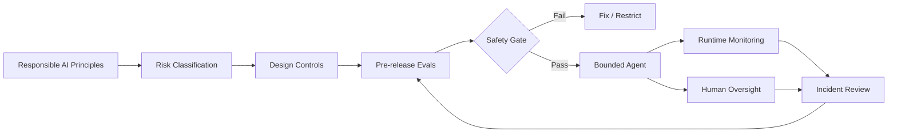

# Responsible AI Is Not a Policy Document: A Production Safety Architecture for AI Agents

Responsible AI often starts as a set of principles: fairness, privacy, transparency, safety and accountability.

Those principles matter. But an enterprise AI agent does not become responsible because a document says it should.

It becomes safer when those principles are translated into **architecture, controls, evaluations, approval boundaries and operational evidence**.

> **Responsible AI becomes real when a principle can be mapped to a control, a test, an owner and evidence.**

## From principles to runtime controls



The key shift is simple: **safety is a system property, not only a model property.**

## 1. Start with the consequence, not the model

Before selecting guardrails, ask what the agent can actually affect.

An internal summarization assistant and an agent that can change a customer's account should not have the same safety architecture.

I classify the workflow around questions such as:

- What decisions can the agent influence?
- What actions can it execute?
- Can an error be reversed?
- What data can it access?
- Who is affected by a failure?
- What is the financial, regulatory or customer impact?
- When must a human remain accountable?

Higher consequence should mean stronger evidence, narrower permissions and more explicit human control.

## 2. Separate reasoning from authority

One of the most useful production patterns is:

> **The model proposes. The system authorizes.**

An LLM may reason that a refund is appropriate. That does not mean the LLM should have unrestricted authority to issue any refund.

Expose a narrow tool such as:

```text
issue_refund(
    order_id,
    amount,
    reason
)
```

Then enforce outside the model:

- authenticated identity
- authorization
- maximum refund amount
- eligible order state
- duplicate-action prevention
- policy checks
- audit logging
- human approval above a threshold

The model can reason. **Deterministic systems should enforce authority.**

## 3. Defense in depth beats one perfect guardrail

No single prompt, classifier or policy layer should carry the entire safety burden.

A production agent can combine:

**Input controls** → authentication, validation, prompt-injection defenses and data classification.

**Reasoning controls** → grounded context, explicit behavioral boundaries and constrained tools.

**Action controls** → least privilege, deterministic validation, approval gates and idempotency.

**Output controls** → policy validation, citation checks, sensitive-data filtering and safe escalation.

**Operational controls** → traces, evals, anomaly detection, incident response and rollback.

Each layer assumes another layer may eventually fail.

## 4. Human-in-the-loop should be risk-based

Human review should not mean sending every interaction to a person.

It should be an intentional control at the point where consequence exceeds the agent's authorized autonomy.

```text
LOW RISK       → Agent executes
MEDIUM RISK    → Agent executes within strict limits + monitoring
HIGH RISK      → Agent recommends; human approves
PROHIBITED     → Agent refuses / escalates
```

The objective is **bounded autonomy**, not maximum autonomy.

## 5. Safety must be evaluated

A safety control that has never been tested is an assumption.

A useful safety evaluation set includes:

- unauthorized tool attempts
- prompt injection
- sensitive-data leakage
- fabricated evidence
- missing evidence
- conflicting instructions
- ambiguous authorization
- unsafe escalation
- tool failures and retries
- adversarial user behavior

For agentic systems, evaluate the trajectory as well as the final response.

An agent that eventually gives the correct answer after attempting an unauthorized action did not behave correctly.

## 6. Make production incidents improve the system

Responsible AI does not stop at launch.

```text
Production signal
      ↓
Validate incident
      ↓
Root cause
      ↓
Create regression case
      ↓
Improve control
      ↓
Re-run safety evals
      ↓
Controlled release
```

This turns failures into institutional learning rather than isolated incident reports.

## 7. Build evidence for accountability

For consequential workflows, teams should be able to answer:

- Which model/version ran?
- Which policy and prompt version applied?
- What context was retrieved?
- Which tools were called?
- What arguments were supplied?
- Which authorization checks ran?
- Did a human approve the action?
- Which eval suite qualified the release?
- What happened when something failed?

Governance becomes much easier when the architecture produces this evidence by design.

## The production principle

Responsible AI is not a final checklist added before launch.

It is the engineering discipline of deciding **what the AI may do, what it may not do, how we test those boundaries, who remains accountable, and how we learn when reality exposes something we missed.**

> **The goal is not an agent that can do everything. It is an agent that can be trusted to do the right things within clearly defined boundaries.**

---

Part of **Production Applied AI** — practical architectures, patterns and lessons for building enterprise AI systems.
