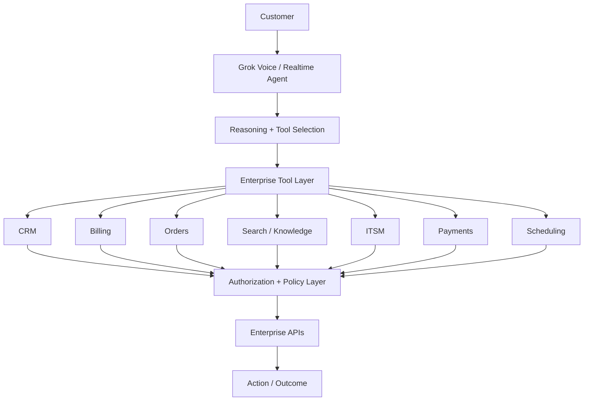
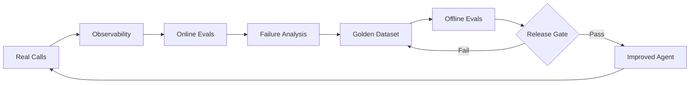

# From Conversation to Business Outcome: Solving Real Enterprise Problems with Grok Voice

Voice AI becomes interesting when the conversation can change a business outcome.

A customer rarely calls because they want to talk to an AI. They call because something needs to happen: their internet is down, a payment looks wrong, an order has not arrived, they want to buy something, or they need an appointment changed.

The production question is therefore not:

> **Can the AI have a natural conversation?**

It is:

> **Can the AI understand an ambiguous request, navigate enterprise systems, take the right action, and complete the customer's objective—without losing the natural flow of conversation?**

That is the lens through which I think about **Grok Voice**.

xAI's Voice API combines realtime voice interaction with reasoning and tool use. Recent Grok Voice releases have also emphasized conversational dynamics and tool reliability—important capabilities when a conversation becomes a multi-step business workflow.

## 1. Telecom support: "My internet isn't working"

This sounds like a support question. In reality, resolving it may require several actions:

**Identify customer → retrieve account → check outage → inspect device → run diagnostics → attempt remediation → create ticket → schedule technician**

A traditional IVR forces the customer through a predetermined tree. A production voice agent can let the customer simply explain the problem naturally.

```text
Customer
   ↓
Grok Voice
   ↓
Intent + conversational reasoning
   ↓
Tool orchestration
   ├── Customer lookup
   ├── Outage check
   ├── Device diagnostics
   ├── Network reset
   ├── Ticket creation
   └── Technician scheduling
   ↓
Policy / authorization layer
   ↓
Action
```

The conversation can be flexible while the actions remain controlled.

> **Model proposes. System authorizes.**

The model can determine which capability is needed. Enterprise systems still enforce identity, authorization, policy and business rules.

The business metrics I would measure are **containment rate, first-call resolution, average handling time, repeat calls, escalation rate and cost per resolved interaction**.

## 2. Sales: "Which plan should I buy?"

Voice AI can become a revenue system, not just a support system.

Imagine a prospect saying:

> "I work from home, have four people in the house and stream a lot. Which plan should I take?"

A useful agent should not simply read a product catalog. It should discover the customer's needs, retrieve eligible products, explain trade-offs, answer objections and—with authorization—complete the transaction.

```text
Understand need
      ↓
Check availability
      ↓
Retrieve eligible plans
      ↓
Compare options
      ↓
Answer objections
      ↓
Confirm customer
      ↓
Create order
      ↓
Schedule activation
```

This is where tool orchestration becomes more valuable than conversation alone.

xAI has published Starlink as a real-world Grok Voice deployment for sales and customer support, spanning many tools and workflows. The important architectural lesson is broader than any single deployment: **voice becomes commercially valuable when conversation connects directly to an outcome.**

The metrics become **conversion rate, completed orders, abandonment, revenue per conversation and cost per acquisition**.

> **The Voice AI metric I care about isn't how human the voice sounds. It's whether the conversation successfully moves the customer toward an outcome.**

## 3. Financial services: "I don't recognize this transaction"

Now the consequence changes.

A customer reports a suspicious card transaction. Here, maximum autonomy is not necessarily the goal.

```text
Customer reports transaction
          ↓
Verify identity
          ↓
Retrieve transaction
          ↓
Collect structured evidence
          ↓
Risk / policy evaluation
       ↙       ↘
 Low risk     High risk
    ↓             ↓
Next step      Human review
```

The model may gather information, reason over evidence and explain the next step. Deterministic systems should still enforce authentication, authorization, transaction limits and regulated workflows.

> **The higher the consequence and autonomy, the higher the evidence bar.**

For financial workflows, I would evaluate not only task completion but also evidence grounding, authorization boundaries, escalation correctness and attempted unauthorized actions.

## 4. Field service: "My machine is showing error E47"

Enterprise Voice AI does not have to mean a contact center.

Consider a field technician standing beside industrial equipment. Their hands may be occupied. Instead of searching manuals, they ask:

> "This unit is showing E47 after compressor restart. What's the next diagnostic step?"

The voice agent could:

```text
Understand equipment + symptom
              ↓
Retrieve service knowledge
              ↓
Check equipment history
              ↓
Guide diagnostics
              ↓
Capture technician observations
              ↓
Call maintenance systems
              ↓
Create/update work order
```

Now Voice AI becomes a **hands-free operational interface**.

The value can be measured through **mean time to repair, technician productivity, first-time fix rate and downtime avoided**.

## 5. Multilingual markets: one workflow, many languages

In markets such as India, a customer may begin in English and naturally switch language halfway through the conversation.

The workflow should not restart because the language changed.

The architecture should separate the conversational layer from the enterprise control layer:

```text
Language → Conversation → Intent → Business workflow

Authorization → Policies → Business rules → Enterprise APIs
```

The customer communicates naturally. The underlying enterprise controls remain deterministic.

That can turn multilingual support from a collection of separate IVR trees into **one conversational business workflow**.

## The production architecture

A production Grok Voice implementation could look like this:



The important boundary is deliberate: **the model reasons about what should happen; trusted systems determine what is allowed to happen.**

For enterprise integration, tools should be narrow and explicit. MCP can provide a standardized interface where appropriate, but it does not replace authentication, authorization or business controls in the underlying systems.

## Evaluate the conversation AND the action

A voice agent can sound excellent and still fail the customer.

I would evaluate four layers.

### Conversation

Did it understand accents, interruptions, corrections and turn-taking?

### Reasoning

Did it correctly understand what the customer was trying to accomplish?

### Tool trajectory

Did it choose the right tool, arguments and sequence? Did it make unnecessary calls, attempt unauthorized actions, or recover correctly after a failure?

### Business outcome

Was the issue actually resolved? Was the order completed? Was the appointment booked? Was escalation appropriate?

That creates a continuous production loop:



> **Observability tells us what happened. Evals tell us whether what happened was acceptable.**

## Why Grok Voice gets interesting

The differentiator worth exploring is not simply whether Grok produces natural speech.

It is the combination of:

**Realtime conversation + reasoning + tool orchestration + multilingual interaction + enterprise actions**

That creates an important architectural possibility: the conversation does not have to feel disconnected from the work happening behind it.

For enterprise Voice AI, latency is not simply a model metric.

> **Latency is experienced as conversation quality.**

## The bigger opportunity

I do not think the long-term opportunity for Voice AI is simply replacing the IVR.

It is creating a **realtime conversational action layer over enterprise systems**.

CRM already knows the customer. Billing already knows the balance. Order systems already know the shipment. ITSM already knows the incident.

Voice AI provides a natural interface through which people can reason over those systems and—within carefully designed boundaries—take action.

The architecture becomes:

**Conversation → Reasoning → Tools → Authorization → Action → Evaluation → Learning**

And the question shifts from:

> **How human does the AI sound?**

to:

> **What business outcome can this conversation safely complete?**

That is where production Voice AI becomes much more interesting.

## References

- [xAI Voice API](https://x.ai/api/voice)
- [Grok Voice Think Fast 2.0](https://x.ai/news/grok-voice-think-fast-2)
- [Grok Voice Think Fast 1](https://x.ai/news/grok-voice-think-fast-1)
- [Grok Voice Agent Builder](https://x.ai/news/grok-voice-agent-builder)
- [Grok STT and TTS APIs](https://x.ai/news/grok-stt-and-tts-apis)

---

*Personal technical perspective. Product capabilities change quickly; validate current platform documentation when designing a production system.*
