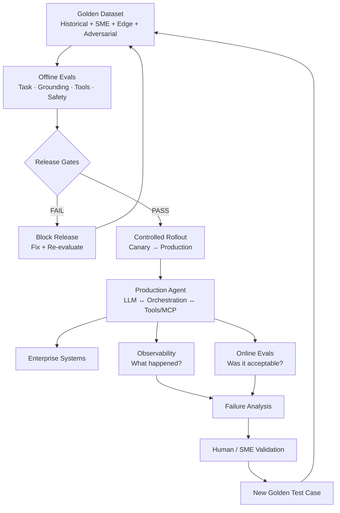

# Your AI Agent Passed 99% of Evals. Why Can It Still Fail in Production?

A 99% evaluation pass rate sounds production-ready. **It may not be.**

Imagine an enterprise AI agent passes 990 of 1,000 evaluation cases. The remaining 10 failures look small on a dashboard. But what if one failure is an unauthorized action? What if the agent selects the wrong tool with valid-looking arguments? What if it fabricates evidence in a regulated workflow?

For production AI agents, **average accuracy is not enough**.

> **What failed, how severe was the failure, and will we detect the next failure when the agent meets the real world?**

This is why production AI needs **golden datasets, offline evals, online evals, release gates, and observability working together**.

## The architecture



The important point is that evaluation is **not a one-time test before launch**. It is a feedback loop.

## 1. Why 99% can still be a production failure

Consider two agents:

| Agent | Result |
|---|---|
| Agent A | 99% pass; 10 failures are formatting issues |
| Agent B | 99% pass; 9 formatting failures + 1 unauthorized high-impact action |

The headline metric is identical. The production risk is not.

A useful evaluation system considers **severity as well as frequency**.

| Severity | Example | Typical implication |
|---|---|---|
| Critical | Unauthorized action, fabricated consequential evidence, sensitive-data violation | Block release |
| High | Wrong policy, materially incorrect recommendation | Investigate; usually block |
| Medium | Incomplete response, unnecessary tool call | Assess against business tolerance |
| Low | Style or formatting issue | Usually non-blocking |

> **A high average score cannot compensate for a catastrophic failure mode.**

## 2. Why golden datasets matter

A **golden dataset** is a curated collection of representative cases with defined expected behavior or evaluation criteria.

It should include more than happy paths:

- representative historical cases
- SME-created scenarios
- known production failures
- edge cases
- adversarial cases
- missing/conflicting evidence
- tool failures and timeouts
- authorization-boundary scenarios

For an insurance claims agent, a test case could contain an active policy, prescription and invoice, but a missing mandatory clinical document.

The expected behavior might require the agent to:

1. retrieve the correct policy,
2. identify the missing evidence,
3. not invent the missing information,
4. not approve the claim,
5. escalate/request evidence,
6. cite the relevant policy.

Now we have a reusable regression test.

Every change to the **model, prompt, RAG pipeline, tool definitions, MCP integration, policy or orchestration** can be tested against the same important behaviors.

### Golden does not mean frozen

A golden dataset should learn from production:

**Production failure → validate → root cause → add test case → fix → rerun regression suite.**

The golden dataset becomes institutional memory for the agent.

## 3. Offline evals answer: should we release this?

Offline evals run in a controlled environment before deployment.

They can measure:

- task success
- grounding
- retrieval quality
- tool selection
- tool arguments
- safety/policy compliance
- escalation behavior
- latency
- cost

For agents, evaluating only the final answer is risky.

An agent could call the wrong tool, retry with another tool, and eventually produce the right answer. A final-answer evaluator may mark it PASS.

A trajectory evaluator can detect the incorrect tool selection, unnecessary call, additional latency/cost, or unsafe intermediate behavior.

> **A correct final answer does not necessarily mean the agent behaved correctly.**

### Release gates

Instead of treating eval results as an informational dashboard, critical metrics can become release gates.

The exact thresholds should be based on the workload and business risk—not a universal number.

**The higher the consequence and autonomy, the higher the evidence bar.**

## 4. Why offline evals are not enough

Even an excellent golden dataset is still a model of reality.

**Production is reality.**

Users will ask questions we did not anticipate. Systems time out. Data becomes incomplete. Policies change. Tools return unexpected results. Traffic patterns shift.

Offline evals tell us how the system behaves on cases we know enough to test.

They cannot guarantee every future production interaction.

That is why online evals matter.

## 5. Online evals answer: is the agent still good in the real world?

Online evaluation looks at actual production behavior.

Depending on the application, signals might include:

- user acceptance/modification/rejection
- escalation rate
- tool failure rate
- invalid tool arguments
- sampled groundedness
- policy violations
- latency
- cost
- business outcomes

Imagine a campaign agent passes its offline gates but production shows that users heavily edit 35% of recommendations, a customer-data tool frequently times out, and latency doubles for complex campaigns.

Those signals may never have existed in the original golden dataset.

**Online evals expose what our offline assumptions missed.**

## 6. Observability is not evaluation

I use this distinction:

> **Observability tells me what happened. Evals tell me whether what happened was acceptable.**

A trace can show:

**request → model → customer-profile tool → model → response**

along with latency, tokens, errors and tool calls.

But the trace alone does not tell us whether the correct tool should have been called, whether its arguments were semantically correct, whether the answer was grounded, or whether the business outcome was acceptable.

Production AI needs both.

## 7. Put evals into CI/CD

Evaluation becomes much more powerful when it becomes part of engineering rather than a manual pre-launch exercise.

```text
Prompt / Model / RAG / Tool change
              ↓
          Code commit
              ↓
        CI pipeline
              ↓
   Candidate test environment
              ↓
       Golden dataset
              ↓
 Deterministic + model graders
              ↓
        Release gates
        ↙           ↘
     FAIL           PASS
      ↓               ↓
 Block release     Staging
                      ↓
                Canary rollout
                      ↓
                 Production
                      ↓
                 Online evals
```

Deterministic graders can verify expected tools, arguments, calculations, required fields, schemas and unauthorized actions.

Model-based graders can help evaluate semantic properties such as groundedness, completeness and relevance.

Human SMEs still matter for defining criteria, calibrating graders, adjudicating ambiguous/high-risk cases, and validating consequential failures.

The objective is not to remove humans from evaluation.

It is to make evaluation **repeatable enough to become part of the engineering lifecycle**.

## 8. Close the loop

The strongest system is not one that never fails.

It is one that can **detect, understand, learn from, and prevent recurrence of important failures**.

That gives us a continuous loop:

**Golden dataset → Offline eval → Release gate → Production → Online eval → Failure analysis → New golden case → Regression test.**

So instead of asking:

> **Did our agent pass 99% of tests?**

I prefer:

> **What evidence do we have that this agent can be trusted to take this particular action, at this level of autonomy, under these business constraints?**

A demo proves capability.

A golden dataset creates repeatability.

Offline evals reduce release risk.

Online evals reveal reality.

Observability helps explain what happened.

And production failures make the next version stronger.

---

## About Production Applied AI

This article is part of **Production Applied AI**—practical architectures, patterns and lessons from building enterprise AI systems.

Topics include AI agents, evals, MCP/tool use, RAG, Voice AI, observability, security, reliability, cost and production readiness.
